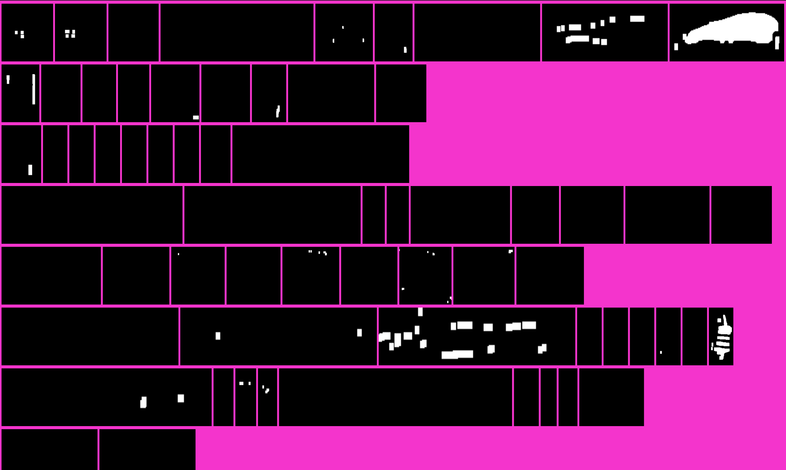
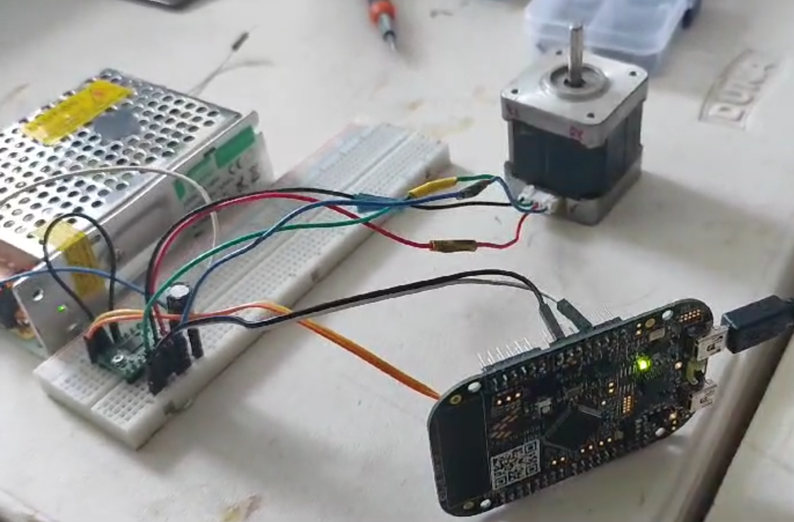
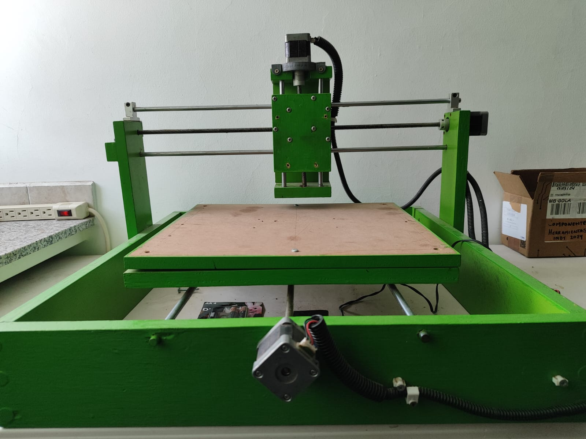

# CircuitVision

## Project Overview

CircuitVision is an automated optical inspection system for PCB (Printed Circuit Board) boards, utilizing a Raspberry Pi 4 and a KL25 microcontroller. The system, integrated with a CNC machine, automates the process of capturing images of PCB boards and evaluating the placement and presence of components.

## Modes of Operation

CircuitVision offers two modes of operation, selectable via a keypad with a menu displayed on an LCD:

1. **Manual Configuration and Picture Taking**  
   - Allows the user to manually control the camera mounted on the CNC machine using a joystick.
   - The user can capture images at any moment, triggering an automatic evaluation of the PCB board based on the selected design.

2. **Automatic Inspection of Preconfigured PCB Boards**  
   - Recommended mode for inspecting multiple PCB boards.
   - The CNC machine automatically captures images of all PCB boards in the test bed, saving and displaying the results on a monitor.

## KL25 Microcontroller

The KL25 microcontroller manages the interaction and control of the following hardware components:

- **LCD Display**
- **Joystick**
- **3x3 Keypad**
- **Stepper Motor Driver Control**
- **UART Communication with Raspberry Pi 4**

The KL25 orchestrates the system's operations and communicates with the Raspberry Pi 4 only when PCB evaluation is required.

## Raspberry Pi 4

The Raspberry Pi 4 handles image processing and evaluation using OpenCV in C++. The main tasks include:

- Capturing images of the PCB board on the CNC bed.
- Processing and evaluating the images.
- Sending results back to the KL25 microcontroller for display on the LCD or monitor (via HDMI).

### Image Evaluation Pipeline

The automatic optical evaluation process is inspired by the following research papers:

- **PCB Defect Detection Using OpenCV with Image Subtraction Method** by Fa Iq Raihan and Win Ce
- **Automatic PCB Inspection Algorithms: A Survey** by Madhav Mogonti and Fikret Ercal

The evaluation pipeline involves the following steps:

1. Capture and save the image.
2. Create a mask to filter the white background.
3. Identify the largest contour (the PCB itself).
4. Correct the perspective and resize the image.
5. Apply preprocessing (blurring, edge detection, conversion to a single channel).
6. Perform XOR operation between reference and evaluation images.
7. Remove noise from the XOR result.
8. Read component bounding box coordinates from a CSV file.
9. Generate a box image for each component.
10. Calculate the percentage of lit pixels and compare it to the allowed maximum.
11. Display and save the results.

## Preview Images

Below are some temporary reference images from the project:

  
  

  
  

